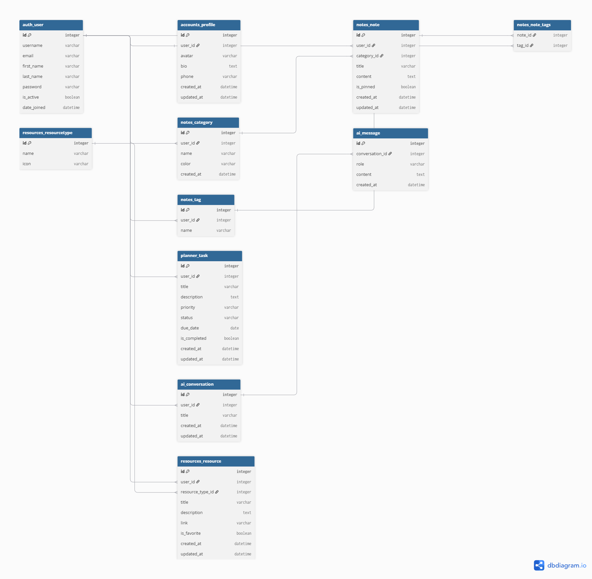

# Mind Nest — Full Project Documentation

> **AI-Powered Study Hub**  
> Django MVT Web Application with Integrated AI Assistant  
> ITI — Django Web Development Course | 2026

---

## Team

| Name | Role |
|------|------|
| Mohamed Ataa | Full Stack Developer |
| Sarah Yasser | Full Stack Developer |

**GitHub:** https://github.com/Mohamed3taa/Mind_Nest  
**Live Demo:** https://web-production-ce34e.up.railway.app

---

## Table of Contents

1. [Project Overview](#1-project-overview)
2. [Technologies](#2-technologies)
3. [Project Structure](#3-project-structure)
4. [Database Design](#4-database-design)
5. [Apps & Features](#5-apps--features)
   - [Accounts](#51-accounts-app)
   - [Dashboard](#52-dashboard-app)
   - [Study Planner](#53-study-planner-app)
   - [Notes](#54-notes-app)
   - [Resources](#55-resources-app)
   - [AI Assistant](#56-ai-assistant-app)
6. [AI Assistant — Deep Dive](#6-ai-assistant--deep-dive)
7. [URL Structure](#7-url-structure)
8. [Frontend — Templates & Static](#8-frontend--templates--static)
9. [Additional Features](#9-additional-features)
10. [Setup & Installation](#10-setup--installation)
11. [Deployment](#11-deployment)
12. [Security Practices](#12-security-practices)

---

## 1. Project Overview

**Mind Nest** is a full-featured web application that helps students organize their academic life. It combines task management, note-taking, resource bookmarking, and a personal AI assistant — all in one platform.

### What Makes It Different

The AI assistant is **not a general chatbot**. It works exclusively on the user's own data — their notes, tasks, resources, and uploaded documents. This makes it a true **personal study assistant**.

### Core Features at a Glance

| Feature | Description |
|---------|-------------|
| Authentication | Register, login, logout, profile management, password reset |
| Dashboard | Live stats, 3 charts, upcoming tasks, recent activity |
| Study Planner | Task CRUD with priority, due date, status tracking |
| Notes | Rich notes with categories, tags, pin, and PDF export |
| Resources | Learning bookmarks with types and favorites |
| AI Assistant | Personal AI powered by Google Gemini — answers from your data only |
| Document Upload | Upload PDF, DOCX, TXT for AI analysis |
| Dark Mode | Full dark/light theme toggle |
| Responsive | Works on all screen sizes |
| PDF Export | Export notes as formatted PDF files |
| Pagination | All list pages are paginated |

---

## 2. Technologies

### Backend
| Technology | Version | Purpose |
|------------|---------|---------|
| Python | 3.10 | Core language |
| Django | 5.2 | Web framework (MVT) |
| PostgreSQL | 18 | Database |
| psycopg2-binary | 2.9 | PostgreSQL driver for Python |
| python-dotenv | 1.2 | Environment variable management |
| gunicorn | 26.0 | Production WSGI server |
| whitenoise | 6.12 | Static file serving in production |

### AI & File Processing
| Library | Purpose |
|---------|---------|
| google-genai | Google Gemini 2.5 Flash API |
| PyPDF2 | Extract text from PDF files |
| python-docx | Extract text from DOCX files |
| reportlab | Generate PDF exports |

### Frontend
| Technology | Purpose |
|------------|---------|
| HTML5 / CSS3 | Structure and styling |
| JavaScript (Vanilla) | AJAX, dark mode, live search |
| Bootstrap 5.3 | UI components and grid |
| Bootstrap Icons 1.11 | Icon library |
| Chart.js 4.4 | Dashboard charts |
| Google Fonts (Inter) | Typography |

---

## 3. Project Structure

```
Mind_Nest/
│
├── mind_nest/                    ← Project configuration
│   ├── settings.py               ← Development settings
│   ├── settings_production.py    ← Production (Railway) settings
│   ├── urls.py                   ← Root URL router
│   └── wsgi.py                   ← WSGI entry point
│
├── accounts/                     ← Authentication & profiles
│   ├── models.py                 ← Profile model
│   ├── views.py                  ← register, login, logout, profile
│   ├── forms.py                  ← All auth forms
│   ├── urls.py                   ← Auth URL patterns
│   ├── signals.py                ← Auto-create profile on user creation
│   └── admin.py
│
├── dashboard/                    ← Home dashboard
│   ├── views.py                  ← Stats aggregation + chart data
│   └── urls.py
│
├── planner/                      ← Task management
│   ├── models.py                 ← Task model
│   ├── views.py                  ← CRUD + AJAX toggle
│   ├── forms.py                  ← TaskForm
│   └── urls.py
│
├── notes/                        ← Note management
│   ├── models.py                 ← Note, Category, Tag models
│   ├── views.py                  ← CRUD + pin + PDF export
│   ├── forms.py                  ← NoteForm, CategoryForm
│   └── urls.py
│
├── resources/                    ← Learning bookmarks
│   ├── models.py                 ← Resource, ResourceType models
│   ├── views.py                  ← CRUD + AJAX favorite
│   ├── forms.py                  ← ResourceForm
│   └── urls.py
│
├── ai_assistant/                 ← AI chat + document upload
│   ├── models.py                 ← AIConversation, AIMessage, UploadedDocument
│   ├── views.py                  ← Chat, upload, Gemini API integration
│   └── urls.py
│
├── templates/                    ← All HTML templates
│   ├── base.html                 ← Master layout
│   ├── includes/
│   │   └── pagination.html       ← Reusable pagination
│   ├── accounts/                 ← 7 auth templates
│   ├── dashboard/
│   ├── planner/
│   ├── notes/
│   ├── resources/
│   └── ai_assistant/
│
├── static/
│   ├── css/main.css              ← All styles + CSS variables
│   ├── js/main.js                ← Dark mode, sidebar, alerts
│   └── images/logo.png
│
├── media/                        ← User-uploaded files (not in git)
│   ├── avatars/                  ← Profile pictures
│   └── ai_documents/             ← Uploaded PDFs/DOCX/TXT
│
├── BackUp_DB/                    ← PostgreSQL database backup
├── screenshots/                  ← Application screenshots
├── ERD.png                       ← Entity Relationship Diagram
├── .env                          ← Secret keys (not in git)
├── .gitignore
├── requirements.txt
├── Procfile                      ← Railway: gunicorn command
└── README.md
```

---

## 4. Database Design

### Entity Relationship Diagram



### Tables Overview

| # | Table | App | Description |
|---|-------|-----|-------------|
| 1 | `auth_user` | Django built-in | Core user data (username, email, password) |
| 2 | `accounts_profile` | accounts | Extended user info (avatar, bio, phone) |
| 3 | `notes_category` | notes | User-defined note categories with color |
| 4 | `notes_tag` | notes | User-defined tags for notes |
| 5 | `notes_note` | notes | Notes with content, pin status |
| 6 | `planner_task` | planner | Study tasks with priority and status |
| 7 | `resources_resourcetype` | resources | Lookup: Video, Article, Course, etc. |
| 8 | `resources_resource` | resources | Saved learning links |
| 9 | `ai_conversation` | ai_assistant | AI chat sessions |
| 10 | `ai_message` | ai_assistant | Individual messages in conversations |
| 11 | `ai_uploadeddocument` | ai_assistant | Uploaded files for AI analysis |

### Relationships

```
auth_user
  │
  ├── (One-to-One) ──► accounts_profile
  │
  ├── (One-to-Many) ──► notes_category
  │                         └── (One-to-Many) ──► notes_note
  │
  ├── (One-to-Many) ──► notes_tag
  │                         └── (Many-to-Many) ──► notes_note
  │
  ├── (One-to-Many) ──► planner_task
  │
  ├── (One-to-Many) ──► resources_resource
  │                         └── (Many-to-One) ──► resources_resourcetype
  │
  ├── (One-to-Many) ──► ai_conversation
  │                         └── (One-to-Many) ──► ai_message
  │
  └── (One-to-Many) ──► ai_uploadeddocument
```

### Key Model Fields

**Task Model**
```python
class Task(models.Model):
    user         → ForeignKey(User)
    title        → CharField(200)
    description  → TextField(blank=True)
    priority     → choices: low / medium / high
    status       → choices: todo / in_progress / done
    due_date     → DateField(null=True)
    is_completed → BooleanField(default=False)
```

**Note Model**
```python
class Note(models.Model):
    user      → ForeignKey(User)
    category  → ForeignKey(Category, null=True)   # optional
    tags      → ManyToManyField(Tag)              # multiple tags
    title     → CharField(200)
    content   → TextField()
    is_pinned → BooleanField(default=False)
```

**UploadedDocument Model**
```python
class UploadedDocument(models.Model):
    user           → ForeignKey(User)
    title          → CharField(200)
    file           → FileField(upload_to='ai_documents/')
    doc_type       → choices: pdf / docx / txt
    extracted_text → TextField()    # stored at upload time
```

---

## 5. Apps & Features

---

### 5.1 Accounts App

**Purpose:** Handles all user authentication and profile management.

#### Models

**Profile** — extends Django's built-in User with extra fields:
- `avatar` — profile image (stored in `media/avatars/`)
- `bio` — short text about the user
- `phone` — phone number

A Profile is created **automatically** when a new User registers, via Django signals:
```python
@receiver(post_save, sender=User)
def create_profile(sender, instance, created, **kwargs):
    if created:
        Profile.objects.create(user=instance)
```

#### Views & URLs

| View | URL | Method | Description |
|------|-----|--------|-------------|
| `register_view` | `/accounts/register/` | GET/POST | New user registration |
| `login_view` | `/accounts/login/` | GET/POST | User login |
| `logout_view` | `/accounts/logout/` | POST | Logout |
| `profile_view` | `/accounts/profile/` | GET/POST | View & edit profile |
| `change_password_view` | `/accounts/change-password/` | GET/POST | Change password |
| Built-in | `/accounts/password-reset/` | GET/POST | Forgot password |

#### Password Reset Flow
1. User enters email at `/accounts/password-reset/`
2. Django generates a secure token and sends an email with a reset link
3. User clicks the link → `/accounts/password-reset-confirm/<uidb64>/<token>/`
4. User enters new password → done
5. In development: reset link printed in terminal (console backend)
6. In production: real email sent via Gmail SMTP

#### Forms
- `RegisterForm` — extends Django's `UserCreationForm`, adds email uniqueness check
- `LoginForm` — username + password
- `UpdateUserForm` — edits name and email (with uniqueness check excluding self)
- `UpdateProfileForm` — edits avatar, bio, phone
- `CustomPasswordChangeForm` — uses Django's built-in form

---

### 5.2 Dashboard App

**Purpose:** The home page after login. Aggregates data from all apps.

#### What It Shows
- **4 Stat Cards** — Total Tasks, Notes, Resources, AI Conversations
- **3 Charts** (Chart.js):
  - Doughnut: Tasks by Priority (High / Medium / Low)
  - Bar: Tasks by Status (To Do / In Progress / Done)
  - Doughnut: Content Overview (Tasks / Notes / Resources / AI)
- **Task Progress Ring** — SVG circle showing completion percentage
- **Upcoming Tasks** — tasks due within the next 7 days
- **Recent Notes** — last 5 updated notes
- **Recent Resources** — last 4 added resources

#### How Charts Work
The Django view serializes data to JSON and passes it to the template:
```python
priority_data = {
    'labels': ['High', 'Medium', 'Low'],
    'data': [high_count, medium_count, low_count],
    'colors': ['#ef4444', '#f59e0b', '#22c55e']
}
```
In the template, Chart.js reads this JSON and renders the chart:
```javascript
const priorityData = {{ priority_data|safe }};
new Chart(document.getElementById('priorityChart'), {
    type: 'doughnut',
    data: { labels: priorityData.labels, datasets: [{ data: priorityData.data }] }
});
```

---

### 5.3 Study Planner App

**Purpose:** Manage study tasks with full CRUD, priority levels, due dates, and status tracking.

#### Model Fields
- `title` — task name
- `priority` — `low` / `medium` / `high`
- `status` — `todo` / `in_progress` / `done`
- `due_date` — optional due date (calendar picker)
- `is_completed` — boolean toggle

#### Views & URLs

| View | URL | Description |
|------|-----|-------------|
| `task_list` | `/planner/` | List with filter, search, pagination |
| `task_create` | `/planner/create/` | Create new task |
| `task_edit` | `/planner/<pk>/edit/` | Update task |
| `task_delete` | `/planner/<pk>/delete/` | Delete task |
| `task_toggle` | `/planner/<pk>/toggle/` | Mark complete/incomplete (AJAX) |

#### Key Features
- **Status Tabs** — filter by All / To Do / In Progress / Done
- **Priority Filter** — dropdown filter by priority level
- **Live Search** — JavaScript searches as you type (no page reload)
- **AJAX Toggle** — checkbox marks tasks complete without page reload
- **Priority Borders** — each card has a colored left border (red=high, yellow=medium, green=low)
- **Pagination** — 8 tasks per page

#### AJAX Toggle Flow
```
User clicks checkbox
        ↓
JavaScript: fetch('/planner/<pk>/toggle/', { method: 'POST' })
        ↓
Django view: task.is_completed = not task.is_completed → task.save()
        ↓
Returns: JsonResponse({'is_completed': True})
        ↓
JavaScript updates UI: adds strikethrough text, reduces opacity
```

---

### 5.4 Notes App

**Purpose:** Rich note-taking with categories, tags, pin functionality, and PDF export.

#### Models
- **Category** — user-scoped, has a hex color code (e.g., `#6366f1`)
- **Tag** — user-scoped, lightweight labels
- **Note** — linked to user, optional category, multiple tags (Many-to-Many)

#### Views & URLs

| View | URL | Description |
|------|-----|-------------|
| `note_list` | `/notes/` | Grid view with sidebar filters |
| `note_detail` | `/notes/<pk>/` | Full note content page |
| `note_create` | `/notes/create/` | Create note |
| `note_edit` | `/notes/<pk>/edit/` | Edit note |
| `note_delete` | `/notes/<pk>/delete/` | Delete note |
| `note_toggle_pin` | `/notes/<pk>/pin/` | Pin/unpin note |
| `export_note_pdf` | `/notes/<pk>/export-pdf/` | Download single note as PDF |
| `export_all_notes_pdf` | `/notes/export-all-pdf/` | Download all notes as PDF |
| `category_create` | `/notes/category/create/` | Create category |
| `category_delete` | `/notes/category/<pk>/delete/` | Delete category |

#### Key Features
- **Category Sidebar** — filter notes by category with colored dots
- **Tag Cloud** — click any tag to filter notes
- **Color-Coded Cards** — note cards have top border in category color
- **Pin Notes** — pinned notes always appear first
- **Live Search** — searches title AND content in real-time
- **PDF Export** — single note or all notes using ReportLab library
- **Tags System** — comma-separated input, auto-created via `get_or_create`

#### How Tags Work
```python
def save_tags(note, tags_input, user):
    note.tags.clear()                        # remove old tags
    for name in tags_input.split(','):
        name = name.strip().lower()
        tag, _ = Tag.objects.get_or_create(user=user, name=name)
        note.tags.add(tag)                   # add to M2M relation
```

#### PDF Export (ReportLab)
```python
buffer = BytesIO()                           # in-memory file
doc = SimpleDocTemplate(buffer, pagesize=A4)
elements = [title, meta, hr, content, footer]
doc.build(elements)                          # render to PDF
response = HttpResponse(buffer, content_type='application/pdf')
response['Content-Disposition'] = 'attachment; filename="note.pdf"'
```

---

### 5.5 Resources App

**Purpose:** Save and organize learning links with resource types and favorites.

#### Models
- **ResourceType** — lookup table: Video, Article, Course, Book, Tool, GitHub, Other
  - Each has a Bootstrap icon class (e.g., `bi-play-circle`)
  - Pre-seeded via Django data migration (runs automatically on `migrate`)
- **Resource** — title, description, URL, type, favorite flag

#### Views & URLs

| View | URL | Description |
|------|-----|-------------|
| `resource_list` | `/resources/` | Grid view with filters |
| `resource_create` | `/resources/create/` | Add resource |
| `resource_edit` | `/resources/<pk>/edit/` | Edit resource |
| `resource_delete` | `/resources/<pk>/delete/` | Delete resource |
| `resource_toggle_favorite` | `/resources/<pk>/favorite/` | Toggle favorite (AJAX) |

#### Key Features
- **Type Pills** — one-click filter buttons for each resource type
- **Favorites Toggle** — AJAX star button, no page reload
- **Live Search** — searches title and description
- **Direct Open** — "Open" button opens the link in a new tab
- **Stats Cards** — shows total count and favorites count

#### Data Migration for Resource Types
```python
def seed_resource_types(apps, schema_editor):
    ResourceType = apps.get_model('resources', 'ResourceType')
    types = [
        {'name': 'Video',   'icon': 'bi-play-circle'},
        {'name': 'Article', 'icon': 'bi-file-text'},
        # ... etc
    ]
    for t in types:
        ResourceType.objects.get_or_create(name=t['name'], defaults={'icon': t['icon']})
```

---

### 5.6 AI Assistant App

**Purpose:** A personal study AI that answers exclusively from the user's own data.

> See full details in **Section 6**.

---

## 6. AI Assistant — Deep Dive

### Core Idea

The AI assistant is **not a general chatbot**. It only knows what the user has stored in Mind Nest. If the user asks about something they haven't added — the AI says:

> *"I don't find this in your Mind Nest data. Please add related notes, resources, or upload a document first."*

### What the AI Can Access

Every time the user sends a message, Django automatically collects:

| Source | What's Collected |
|--------|-----------------|
| Uploaded Documents | Extracted text (up to 3000 chars per file) |
| Notes | Title, content, category, tags |
| Tasks | Title, priority, status, due date |
| Resources | Title, description, link, type |

### How It Works — Step by Step

```
User types message and presses Enter
              ↓
JavaScript fetch() sends POST to /ai/<conv_id>/send/
              ↓
Django view (send_message):
  1. Save user message to AIMessage table
  2. Fetch last 10 messages as conversation history
  3. Call build_user_context(user):
       → Queries UploadedDocument, Note, Task, Resource tables
       → Builds one large text block with all user data
  4. Call get_system_prompt(user):
       → Wraps user data in strict instructions:
         "ONLY answer based on this data. Do NOT act as general chatbot."
  5. Call Gemini API:
       → Sends: conversation history + user message + system prompt
       → Model: gemini-2.5-flash
  6. Save AI response to AIMessage table
  7. Return JsonResponse({'response': ai_text})
              ↓
JavaScript receives response → displays in chat UI
No page reload
```

### System Prompt Structure

```python
f"""You are Mind Nest AI, a personal study assistant for {user.username}.

IMPORTANT RULES:
1. You ONLY answer based on the user's data provided below.
2. If the user asks about something NOT in their data, say:
   "I don't find this in your Mind Nest data..."
3. You can help:
   - Summarize or explain their notes and documents
   - Generate quiz questions FROM their notes/documents
   - Create flashcards FROM their notes/documents
   - Review their tasks and suggest priorities
4. Do NOT act as a general knowledge chatbot.

HERE IS THE USER'S DATA:
{user_data}
"""
```

### Document Upload

Supports 3 file types:

| Format | Library | How Text is Extracted |
|--------|---------|----------------------|
| PDF | PyPDF2 | Loops through pages, calls `page.extract_text()` |
| DOCX | python-docx | Reads all paragraph text |
| TXT | Built-in | Decodes bytes as UTF-8 |

Text is extracted **at upload time** and stored in the database. This means:
- No re-parsing on every AI request (faster)
- The file's content is always available even if the file is moved

### Models

```
AIConversation
  ├── id
  ├── user (FK → User)
  ├── title (auto-set from first message)
  └── messages → AIMessage (one-to-many)
                    ├── role: 'user' or 'assistant'
                    └── content: message text

UploadedDocument
  ├── user (FK → User)
  ├── file (stored in media/ai_documents/)
  ├── doc_type: 'pdf' / 'docx' / 'txt'
  └── extracted_text: full text content
```

### URLs

| URL | Description |
|-----|-------------|
| `/ai/` | Main chat page |
| `/ai/new/` | Create new conversation |
| `/ai/<id>/send/` | Send message (AJAX) |
| `/ai/<id>/delete/` | Delete conversation |
| `/ai/upload/` | Upload document |
| `/ai/document/<id>/delete/` | Delete document |

---

## 7. URL Structure

```
/                              → Redirect to /dashboard/
/admin/                        → Django Admin Panel

/accounts/register/            → Register
/accounts/login/               → Login
/accounts/logout/              → Logout (POST)
/accounts/profile/             → Profile page
/accounts/change-password/     → Change password
/accounts/password-reset/      → Forgot password (email)

/dashboard/                    → Dashboard home

/planner/                      → Task list
/planner/create/               → Add task
/planner/<pk>/edit/            → Edit task
/planner/<pk>/delete/          → Delete task
/planner/<pk>/toggle/          → Toggle complete (AJAX)

/notes/                        → Notes grid
/notes/<pk>/                   → Note detail
/notes/create/                 → Add note
/notes/<pk>/edit/              → Edit note
/notes/<pk>/delete/            → Delete note
/notes/<pk>/pin/               → Toggle pin
/notes/<pk>/export-pdf/        → Download PDF
/notes/export-all-pdf/         → Download all notes PDF
/notes/category/create/        → Add category
/notes/category/<pk>/delete/   → Delete category

/resources/                    → Resources grid
/resources/create/             → Add resource
/resources/<pk>/edit/          → Edit resource
/resources/<pk>/delete/        → Delete resource
/resources/<pk>/favorite/      → Toggle favorite (AJAX)

/ai/                           → AI Chat
/ai/new/                       → New conversation
/ai/<id>/send/                 → Send message (AJAX)
/ai/<id>/delete/               → Delete conversation
/ai/upload/                    → Upload document
/ai/document/<id>/delete/      → Delete document
```

---

## 8. Frontend — Templates & Static

### Template Inheritance

All pages extend `base.html`:

```html


Notes — Mind Nest
active   ← highlights sidebar link


  ... page content ...

```

`base.html` provides:
- Sidebar with navigation links
- Top navbar with dark mode toggle + user pill
- Flash messages (auto-dismiss after 4s)
- Bootstrap + CSS + JS imports

Auth pages (login/register) use `` — no sidebar.

### CSS Architecture (main.css)

Uses CSS Custom Properties for full theme control:

```css
:root {
    --primary:   #6366f1;   /* Indigo */
    --secondary: #a855f7;   /* Purple */
    --gradient:  linear-gradient(135deg, #6366f1, #a855f7);
    --surface:   #ffffff;   /* Card background */
    --bg:        #f1f5f9;   /* Page background */
}

[data-bs-theme="dark"] {
    --surface: #1e293b;     /* Override for dark mode */
    --bg:      #0f172a;
}
```

When dark mode toggles, only the `data-bs-theme` attribute changes — all CSS variables update automatically.

### JavaScript (main.js)

Three main features:

**1. Dark Mode**
```javascript
darkBtn.addEventListener('click', function() {
    const next = current === 'dark' ? 'light' : 'dark';
    html.setAttribute('data-bs-theme', next);
    localStorage.setItem('theme', next);   // persist across sessions
});
```

**2. Sidebar Toggle**
- Desktop: adds `.collapsed` class, sidebar slides out
- Mobile: adds `.open` class + shows dark overlay with blur

**3. Auto-dismiss Alerts**
```javascript
setTimeout(() => bootstrap.Alert.getOrCreateInstance(alert).close(), 4000);
```

### AJAX Pattern (used in 3 places)

```javascript
fetch('/endpoint/', {
    method: 'POST',
    headers: {
        'X-CSRFToken': '{{ csrf_token }}',    // Django security
        'Content-Type': 'application/json'
    },
    body: JSON.stringify({ data: value })
})
.then(r => r.json())
.then(data => { /* update UI */ });
```

Used for: task complete toggle, resource favorite toggle, AI chat messages.

---

## 9. Additional Features

### Dark Mode
- Toggle button in top navbar (moon/sun icon)
- Uses CSS variables — instant theme switch
- Preference saved in `localStorage` — persists after browser close

### Pagination
- Django `Paginator` class — 8 tasks / 9 notes / 9 resources per page
- Shared `pagination.html` component used across all list pages
- Preserves all active filters in page navigation links

### Responsive Design
- Bootstrap 5 grid system
- Mobile sidebar: slides from left with dark overlay
- Breakpoints at 768px (tablet) and 576px (mobile)

### Image Upload (Profile)
- `ImageField` with `upload_to='avatars/'`
- Stored in `media/avatars/`
- Requires `pillow` library for image processing
- Form must use `enctype="multipart/form-data"`

### Password Reset
- Django's built-in `PasswordResetView`
- Development: email printed in terminal
- Production: real email via Gmail SMTP (configured in `.env`)

### PDF Export
- Single note or all notes at once
- Built with `reportlab` — creates formatted PDF in memory (no temp files)
- Includes: title, author, date, category, tags, content, footer

### Charts
- Chart.js loaded from CDN
- Data prepared as JSON in Django view, passed to template
- 3 chart types: Doughnut (priority), Bar (status), Doughnut (overview)

---

## 10. Setup & Installation

### Prerequisites
- Python 3.10+
- PostgreSQL 18
- Git

### Step-by-Step

**1. Clone the repository**
```bash
git clone https://github.com/Mohamed3taa/Mind_Nest.git
cd Mind_Nest
```

**2. Create virtual environment**
```bash
python -m venv venv
venv\Scripts\activate        # Windows
source venv/bin/activate     # Mac/Linux
```

**3. Install dependencies**
```bash
pip install -r requirements.txt
```

**4. Create `.env` file** in the project root:
```env
SECRET_KEY=any-random-secret-string
DEBUG=True

DB_NAME=mind_nest_db
DB_USER=postgres
DB_PASSWORD=your_postgres_password
DB_HOST=localhost
DB_PORT=5432

AI_API_KEY=your_gemini_api_key

EMAIL_HOST_USER=your_gmail@gmail.com
EMAIL_HOST_PASSWORD=your_gmail_app_password
```

**5. Create PostgreSQL database**
- Open pgAdmin
- Right-click Databases → Create → Database
- Name it: `mind_nest_db`

**6. Run migrations**
```bash
python manage.py migrate
```

**7. Create admin user**
```bash
python manage.py createsuperuser
```

**8. Run the server**
```bash
python manage.py runserver
```

**9. Open in browser**
```
http://127.0.0.1:8000
```

### Getting a Gemini API Key
1. Go to https://aistudio.google.com
2. Sign in with Google account
3. Click "Get API Key"
4. Copy the key into `.env` as `AI_API_KEY`

---

## 11. Deployment

### Platform: Railway

The project is deployed on [Railway](https://railway.app) with a PostgreSQL database.

**Live URL:** https://web-production-ce34e.up.railway.app

### Deployment Files

**`Procfile`** — tells Railway how to start the app:
```
web: gunicorn mind_nest.wsgi --log-file -
```

**`settings_production.py`** — production overrides:
- `DEBUG = False`
- Database from `DATABASE_URL` environment variable (set by Railway)
- WhiteNoise middleware for static files
- CSRF trusted origins for Railway domain

**`nixpacks.toml`** — Railway build configuration:
```toml
[variables]
MISE_PYTHON_GITHUB_ATTESTATIONS = "false"
DJANGO_SETTINGS_MODULE = "mind_nest.settings_production"
```

### Railway Environment Variables

Set these in Railway dashboard → web service → Variables:

```
DJANGO_SETTINGS_MODULE = mind_nest.settings_production
SECRET_KEY             = your-secret-key
AI_API_KEY             = your-gemini-key
DATABASE_URL           = (auto-set by Railway PostgreSQL service)
```

---

## 12. Security Practices

### Access Control
Every view that handles user data is protected:
```python
@login_required
def note_list(request):
    notes = Note.objects.filter(user=request.user)  # only YOUR notes
```

Every get/edit/delete checks ownership:
```python
note = get_object_or_404(Note, pk=pk, user=request.user)
# Returns 404 if note belongs to another user
```

### CSRF Protection
All HTML forms include:
```html

```
All AJAX requests include:
```javascript
headers: { 'X-CSRFToken': '{{ csrf_token }}' }
```

### Secret Management
- All sensitive values (`SECRET_KEY`, `DB_PASSWORD`, `AI_API_KEY`) are in `.env`
- `.env` is in `.gitignore` — never pushed to GitHub
- Railway environment variables for production secrets

### Password Security
- Django hashes all passwords with PBKDF2 algorithm
- Plain-text passwords are never stored
- `update_session_auth_hash()` keeps user logged in after password change

---

## Appendix — Key Packages

```
Django==5.2.17          ← Web framework
psycopg2-binary==2.9.12 ← PostgreSQL driver
python-dotenv==1.2.2    ← .env file loading
google-genai==2.17.0    ← Gemini AI API
PyPDF2==3.0.1           ← PDF text extraction
python-docx==1.2.0      ← DOCX text extraction
reportlab==5.0.0        ← PDF generation
pillow==12.3.0          ← Image processing
gunicorn==26.0.0        ← Production server
whitenoise==6.12.0      ← Static file serving
dj-database-url==3.1.2  ← Parse DATABASE_URL
```

---

*Mind Nest — ITI Django Web Development Course — 2026*  
*Mohamed Ataa & Sarah Yasser*
