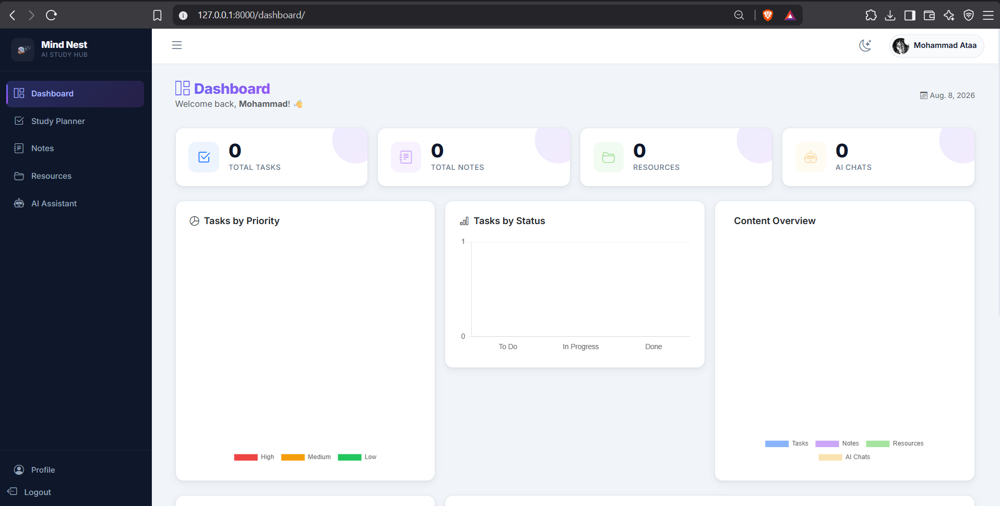
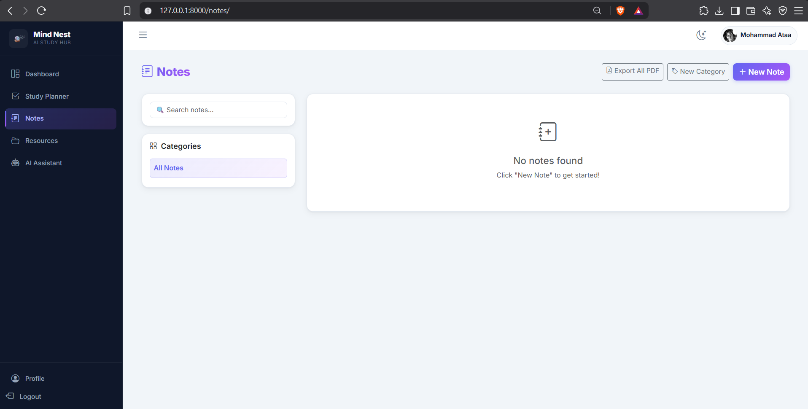
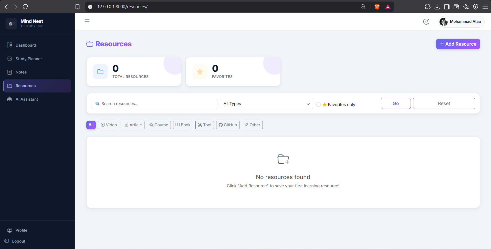

<div align="center">

# 🧠 Mind Nest
### AI-Powered Study Hub

*A Django MVT Web Application with Integrated AI Assistant*


</div>

---

## 📖 Overview

**Mind Nest** is a full-featured web application that helps students organize their study materials, manage tasks, take notes, and save learning resources — all powered by an integrated **Google Gemini AI Assistant**.

---

## ✨ Features

| Feature | Description |
|---------|-------------|
| 🔐 **Authentication** | Register, Login, Logout, Profile, Password Reset |
| 📊 **Dashboard** | Stats overview, Charts, Recent activity, Upcoming tasks |
| ✅ **Study Planner** | Create tasks with priority, due date, and status tracking |
| 📝 **Notes** | Full CRUD with categories, tags, pin, and PDF export |
| 📁 **Resources** | Save learning links with types and favorites |
| 🤖 **AI Assistant** | Chat with Gemini AI for study help |
| 🌙 **Dark Mode** | Toggle between light and dark themes |
| 📱 **Responsive** | Works on all screen sizes |

---

## 🛠️ Technologies

**Backend**
- Python 3.10
- Django 5.2 (MVT Architecture)
- PostgreSQL 18

**Frontend**
- HTML5 / CSS3 / JavaScript
- Bootstrap 5.3
- Chart.js

**AI Integration**
- Google Gemini 2.5 Flash API

---

## 🗄️ Database Design

The project uses **10 related tables** with One-to-Many and Many-to-Many relationships.


---

## 📸 Screenshots

<table>
  <tr>
    <td></td>
    <td></td>
  </tr>
  <tr>
    <td></td>
    <td></td>
  </tr>
  <tr>
    <td></td>
    <td></td>
  </tr>
</table>

---

## 🚀 Setup & Installation

### 1. Clone the repository
```bash
git clone https://github.com/Mohamed3taa/Mind_Nest.git
cd Mind_Nest
```

### 2. Create virtual environment
```bash
python -m venv venv
venv\Scripts\activate       # Windows
source venv/bin/activate    # Mac/Linux
```

### 3. Install dependencies
```bash
pip install -r requirements.txt
```

### 4. Configure environment variables
Create a `.env` file in the root directory:
```env
SECRET_KEY=your-secret-key
DEBUG=True
DB_NAME=mind_nest_db
DB_USER=postgres
DB_PASSWORD=your-password
DB_HOST=localhost
DB_PORT=5432
AI_API_KEY=your-gemini-api-key
EMAIL_HOST_USER=your-email@gmail.com
EMAIL_HOST_PASSWORD=your-app-password
```

### 5. Setup database
```bash
python manage.py migrate
python manage.py createsuperuser
```

### 6. Run the server
```bash
python manage.py runserver
```

Open `http://127.0.0.1:8000` in your browser.

---

## 📁 Project Structure

```
Mind_Nest/
├── mind_nest/          # Project settings & URLs
├── accounts/           # Authentication & Profile
├── dashboard/          # Dashboard & Statistics
├── planner/            # Study Planner & Tasks
├── notes/              # Notes & Categories & Tags
├── resources/          # Learning Resources
├── ai_assistant/       # Gemini AI Chat
├── templates/          # HTML Templates
├── static/             # CSS, JS, Images
├── media/              # User Uploaded Files
├── screenshots/        # Application Screenshots
├── BackUp_DB/          # PostgreSQL Database Backup
├── ERD.png             # Entity Relationship Diagram
├── requirements.txt
└── README.md
```

---

## 👥 Team

| Name | Role |
|------|------|
| Mohamed Ataa | Full Stack Developer |
| Partner | Full Stack Developer |

---

## 📚 Course

**ITI — Django Web Development Course**
Submission Deadline: August 20, 2026

---

<div align="center">
Made with ❤️ using Django & Google Gemini AI
</div>
